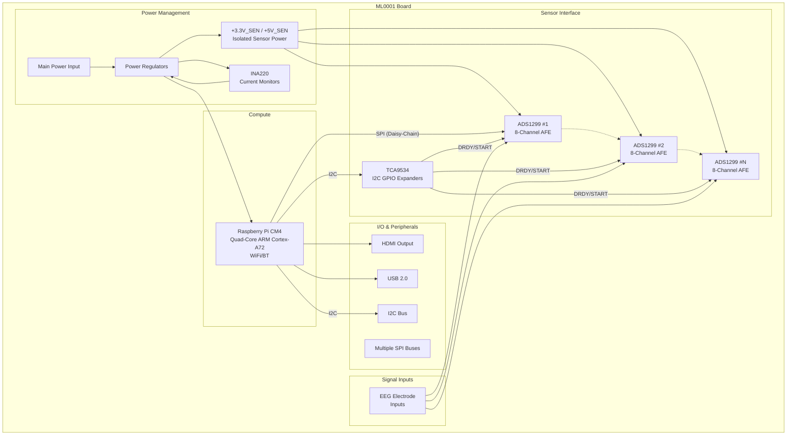

# PCB Design Specification

# Description

ML0001 is a Raspberry Pi Compute Module 4 (CM4) carrier board designed for high-density, multi-channel biopotential signal acquisition. The board features multiple ADS1299 8-channel, 24-bit analog front-end ICs configured in a daisy-chain topology across multiple SPI buses, enabling scalable EEG (electroencephalography) data acquisition with real-time WiFi streaming capabilities. This design is optimized for research-grade biosignal measurement applications requiring high channel counts and precision analog performance.

# Features

- **Raspberry Pi CM4 Integration**: Full support for CM4 compute module with access to high-speed peripherals (PCIe, dual camera interfaces, dual display interfaces)
- **Multi-Channel EEG Acquisition**: Multiple ADS1299 ICs providing 8 channels each of 24-bit resolution biopotential measurement
- **Scalable Architecture**: Daisy-chain configuration across multiple SPI buses for expandable channel count
- **Isolated Sensor Power**: Dedicated +3.3V_SEN and +5V_SEN power rails for sensor interface isolation
- **I2C GPIO Expansion**: TCA9534 I2C GPIO expanders for DRDY and START signal control across multiple ADS1299 devices
- **Current Monitoring**: INA220 precision current/power monitors for power rail diagnostics
- **HDMI Output**: Full HDMI interface for display connectivity
- **USB Connectivity**: USB 2.0 host and device interfaces
- **WiFi Streaming**: Real-time EEG data streaming over WiFi
- **4-Layer PCB**: Optimized stackup for analog signal integrity and power distribution

# Applications

- Multi-channel EEG research and brain-computer interfaces (BCI)
- Clinical neurophysiology signal acquisition
- High-density biosignal recording systems
- Real-time neural signal processing platforms
- Portable EEG monitoring devices with embedded processing

# Block Diagram

# Technical Specifications

## Processing
- **Processor**: Broadcom BCM2711 (via CM4)
  - Quad-core ARM Cortex-A72 @ 1.5 GHz
  - 1GB - 8GB LPDDR4 RAM (depending on CM4 variant)
  - Optional eMMC storage

## Analog Front-End
- **ADC IC**: Texas Instruments ADS1299
  - Resolution: 24-bit
  - Channels per IC: 8 differential inputs
  - Sample Rate: Up to 16 kSPS
  - Input-Referred Noise: 1 µVpp (typical)
  - CMRR: -110 dB
  - Built-in programmable gain amplifier (1, 2, 4, 6, 8, 12, 24)

## Connectivity
- HDMI 2.0 (via CM4)
- USB 2.0 Host/Device
- Multiple SPI buses (for ADS1299 communication)
- I2C (for GPIO expanders and general use)
- WiFi 802.11ac (via CM4)
- Bluetooth 5.0 (via CM4)

## Power
- Isolated sensor power rails with monitoring
- Multiple regulated voltage outputs (+3.3V, +5V, +3.3V_SEN, +5V_SEN)

## Physical
- **PCB Layers**: 4
- **Form Factor**: CM4 carrier board

# Firmware/Software

The board includes Python-based acquisition software with the following capabilities:
- Hardware reset sequencing for ADS1299 devices
- Multi-SPI bus management with daisy-chain support
- I2C GPIO expander control for synchronization signals
- TCP/IP streaming server for real-time data visualization
- PyQt5-compatible client visualization support

See `boards/ML0001/bringup/` directory for detailed implementation.
